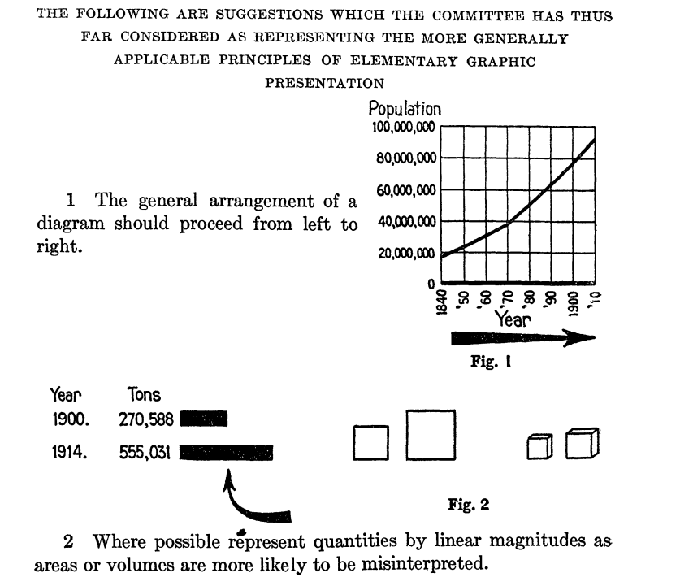

<link href="https://fonts.googleapis.com/css?family=Montserrat&display=swap" rel="stylesheet">

<style>
slides > slide {
  font-family: 'Montserrat', sans-serif;
}

.center {
  display: block;
  margin-left: auto;
  margin-right: auto;

}


</style>


```{r setup, include=FALSE}
library(knitr)
library(rgl)
library(ggplot2)
library(plotly)
opts_chunk$set(echo = FALSE)
knit_hooks$set(webgl = hook_webgl)

options(scipen=999)  # turn-off scientific notation like 1e+48
theme_set(theme_bw())  # pre-set the bw theme.
```

# Historia wizualizacji danych

## Standardy



Joint Committee on Standards for Graphic Presentation (1915). **Standards for Graphic Presentation**. Publications of the American Statistical Association 14, 790–797.

# Gramatyka grafiki

## Gramatyka grafiki

Gramatyka grafiki (grammar of graphics).

Wilkinson, Leland, Anushka Anand, and Robert Grossman. "Graph-theoretic scagnostics." IEEE Symposium on Information Visualization, 2005. INFOVIS 2005.. IEEE, 2005.

## Gramatyka grafiki


## Gramatyka grafiki


# Rodzaje wizualizacji

## Rodzaje wizualizacji
```{r, echo=FALSE,warning=FALSE}
ggplot(cbind(expand.grid(x = c("Statyczne", "Interaktywne"),
                         y = c("Pojedyncza wizualizacja", "Wiele wizualizacji")), 
             software = c("")),
       aes(x = x, y = y, label = software)) +
  geom_tile(fill = NA, color = "black") +
  geom_text()  +
  theme_void() +
  theme(axis.text = element_text(color = "black"))
```
  
1. Wizualizacje statyczne.
3. Infografiki.
2. Wizualizacje interaktywne.
3. Dashboardy.

## Wizualizacja statyczna

```{r, echo=FALSE,warning=FALSE}
data("midwest", package = "ggplot2")
# midwest <- read.csv("http://goo.gl/G1K41K")  # bkup data source

# Scatterplot
gg <- ggplot(midwest, aes(x=area, y=poptotal)) + 
  geom_point(aes(col=state)) + 
  geom_smooth(method="loess", se=F) + 
  xlim(c(0, 0.1)) + 
  ylim(c(0, 500000)) + 
  scale_color_discrete("") +
  labs(y="Population", 
       x="Area") +
  theme_bw()

gg
```

## 3D


## Infografiki

Inspiracje: [VennGage](https://venngage.com/)


## Wizualizacje interaktywne

```{r, echo=FALSE,warning=FALSE}
ggplotly(gg)
```

## Dashboardy


## Czcionki

1. Czcionka do tytułów/nagłówków.
2. Treść dokumentu.
3. Wyróżnianie treści.

## Czcionki

<a href="https://cdn.dribbble.com/users/18730/screenshots/1593976/attachments/246597/full_pixels.png"></a>

## Kolory

<a href="https://venngage-wordpress.s3.amazonaws.com/uploads/2016/08/true-colors.png"></a>

## Kolory

Kolory mogą nawiązywać do treści wizualizacji...

<a href="https://venngage-wordpress.s3.amazonaws.com/uploads/2015/10/6fb75103-db4f-4cb5-ab51-d61be9ea7b2d-1.png"></a>

## Kolory

... ale schemat kolorystyczny powinien być utrzymany w całej infografice.

<a href="https://technofaq.org/wp-content/uploads/2015/04/Uber-Vs-Hailo-The-Battle-of-the-Taxi-Apps.jpg"></a>

## Prostota

Infografika może zawierać tylko jeden wykres, co nie przekłada się na łatwość jej zrozumienia.

## Prostota

<a href="http://s3.amazonaws.com/wp_media-prod/app/uploads/2015/09/24112730/Infographic_Design_Example_GOOD.jpeg"></a>


## Grafiki

Elementy graficzne nawiązujące do treści wzmacniają przekaz i pozwalają lepiej zrozumieć dane.

## Grafiki

<a href="http://s3.amazonaws.com/wp_media-prod/app/uploads/2015/09/24112845/Infographic_Design_Example_Captora.jpg"></a>

# Błędy w wizualizacjach

## Złe wizualizacje


Trudne porównania - niewłaściwie wybrana metoda wizualizacja.

## Złe wizualizacje


Niewłaściwie wybrana metoda wizualizacji.

## Złe wizualizacje


Zbyt duża ilość informacji na jednym wykresie.


## Wizualizacje i prawda


How to Lie with Statistics, Darrell Huff

## Korelacje i współwystępowanie


## Trzeci wymiar


## Wykresy kołowe


## Wykresy kołowe


## Ucięte osie


## Ucięte osie


# Narzędzia do wizualizacji

## Narzędzia

1. Programistyczne (R, Python, JavaScript)
2. Programy graficzne (Inkscape).
3. Programy dedykowane do wizualizacji danych (Tableau).

## Języki wizualizacji danych

```{r}
ggplot(cbind(expand.grid(x = c("Imperatywne", "Deklaratywne"),
                         y = c("Proste do użycia", "Wszechstronne")), 
             software = c("Seaborn", "Bokeh\nR (ggplot2)\nLeaflet\nVega-Lite",  "Matplotlib\nR (base, grid)", "BQPlot\nD3\nPlotly\nVega")),
       aes(x = x, y = y, label = software)) +
  geom_tile(fill = NA, color = "black") +
  geom_text()  +
  theme_void() +
  theme(axis.text = element_text(color = "black"))
```

## Podział narzędzi do wizualizacji danych

Deklaratywne:

 - zadanie: warunki jakie musi spełniać wizualizacja,
 - jak wizualizacja jest wykonywana jest rozstrzygane wewnętrznie i niezależnie od użytkownika,
 - oddzielenie specyfikacji od wykonania.

Imperatywne:

 - zadanie: krok po kroku jak stworzyć wizualizację,
 - użytkownik w pełni kontroluje każdy detal wizualizacji,
 - jeśli warunki jakie musi spełniać wizualizacja zmienią się nawet odrobinę, instrukcja tworzenia może się zmienić znacząco.

## Altair (Python)

https://altair-viz.github.io/gallery/simple_bar_chart.html

https://altair-viz.github.io/gallery/scatter_tooltips.html

https://altair-viz.github.io/gallery/line_with_ci.html

## Altair (Python)

Pythonowe API dla Vega-Lite.

Brian Granger, uzasadniając stworzenie Altaira: *I love Python, but do my visualisations using R/ggplot2*.

## Altair (Python)

- Małe wsparcie dla typowo stastycznych wizualizacji

Pakiet R: https://github.com/vegawidget/altair (używa reticulate).

## bokeh (Python)

https://demo.bokeh.org/movies

## bokeh (Python)

- Python jako API do BokehJS,
- praca głownie w Pythonie, JSowy silnik mało dostępny i źle udokumentowany,
- całe dashboardy.

## bokeh (R)

- implementacja w R: https://github.com/bokeh/rbokeh
- ostatni commit: 26.04.2017

## Leaflet 

[Leaflet.js](https://leafletjs.com/): interaktywne mapy.

## Leaflet

W R: https://rstudio.github.io/leaflet/

W Pythonie: https://github.com/python-visualization/folium

## matplotlib (Python)

https://matplotlib.org/

## matplotlib (Python)

- trudne zarządzanie czasem na osiach,
- niesatysfakcjonujące mapowanie do kształtów.

Rozszerzenia: https://mpld3.github.io/

## plot.ly

## seaborn

https://seaborn.pydata.org/ - oparte na matplotlib.

Świetne szablony wizualizacji!

## Vega-Lite

Pakiety w R: https://github.com/hrbrmstr/vegalite i https://github.com/vegawidget/vegawidget

## Vega

JSONowa specyfikacja wizualizacji.

Lyra (nie zniechęcać się http://vega.github.io/lyra/).

Lyra 1.0 jest online i działa satysfakcjonująco: http://idl.cs.washington.edu/projects/lyra/.

## Programy graficzne 

Inkscape: darmowy i otwarty edytor grafiki wektorowej.

 - [Oficjalny tutorial](https://inkscape.org/en/doc/basic/tutorial-basic.pl.html).
 - [Inkscape w praktyce](https://pl.wikibooks.org/wiki/Inkscape_w_praktyce).


