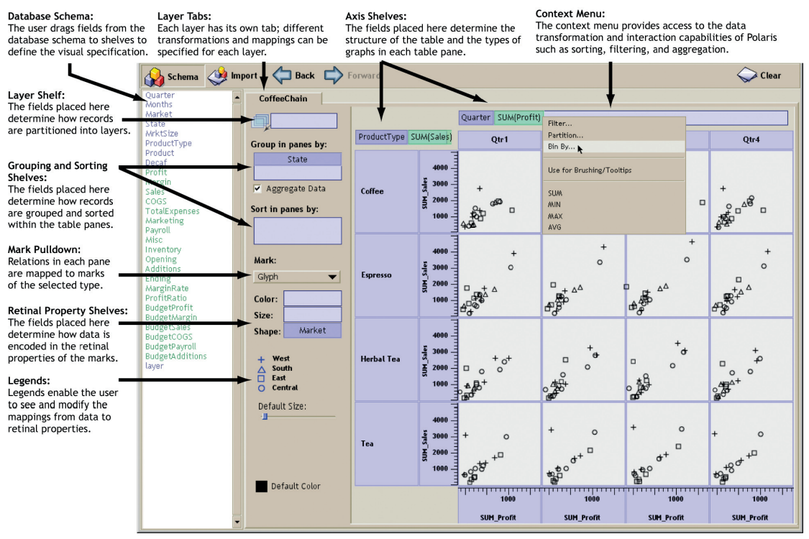

<link href="https://fonts.googleapis.com/css?family=Montserrat&display=swap" rel="stylesheet">

<style>
slides > slide {
  font-family: 'Montserrat', sans-serif;
}

.center {
  display: block;
  margin-left: auto;
  margin-right: auto;

}


</style>


```{r setup, include=FALSE}
library(knitr)
library(rgl)
library(ggplot2)
library(plotly)
library(dplyr)
library(patchwork)
library(ggthemes)
library(ggbeeswarm)
opts_chunk$set(echo = FALSE, message = FALSE, warning = FALSE)
theme_set(theme_bw())  # pre-set the bw theme.
```

## O mnie

Michał Burdukiewicz:

 - bioinformatyk (MiNI PW),
 - 12 lat doświadczenia z R,
 - Stowarzyszenie Wrocławskich Użytkowników R (stwur.pl),
 - Fundacja Why R? (whyr.pl).

Materiały: https://github.com/michbur/WizualizacjaDanychWyklad

Mail: michalburdukiewicz@gmail.com

## Plan spotkań

1. Gramatyka grafiki.
2. Błędy w wizualizacjach danych.
3. **Efektywne projektowanie dashboardów.**
4. **Poprawianie wizualizacji.**
5. **Zaaawansowane wizualizacje danych.**

# Polaris

## Twórcy

"Polaris, an interface for exploring large multi-dimensional databases that extends the well-known Pivot Table interface first popularized by Microsoft Excel."

http://www.graphics.stanford.edu/projects/polaris/

Źródło: *Polaris: a system for query, analysis, and visualization of multidimensional databases*, Proceeding IEEE InfoVis’00 reprinted Commun. ACM 51, 11 (November 2008), 75-84.

Twórcy:

 - Chris Stolte,
 - Diane Tang,
 - Pat Hanrahan.

## Założenie

1. Interfejs do eksploracji danych.
2. Zróżnicowane metody wizualizacji danych.
3. Wizualizacje o wysokiej wymiarowości i gęstości informacji. 

## Tabelaryczne ujęcie danych



## Tabelaryczne ujęcie danych

Zalety:

 - wielowymiarowość,
 - swojskość,
 - łatwość porównań (tabele generują wiele małych przedstawień informacji, które łatwo ze sobą porównywać w celu wskazania trendów/korelacji pomiędzy wymiarami).
 
## Tabelaryczne ujęcie danych


# Efektywne projektowanie dashboardów

## Rodzaje dashboardów

 - analityczne,
 - operacyjne.


Źródło: https://uxplanet.org/

## Analityczny dashboard


Źródło: https://uxplanet.org/


## Operacyjny dashboard


Źródło: https://uxplanet.org/

## Układ treści


Źródło: https://www.sisense.com/blog/4-design-principles-creating-better-dashboards/

## Właściwy dobór wizualizacji do danych

<a href="https://www.tapclicks.com/wp-content/uploads/Charts-and-Graphs-Guide-1024x768.jpg"></a>

Źródło: https://www.tapclicks.com/the-ultimate-guide-to-data-visualization/.

## Interakcja

"*Only 10–15% of people click on buttons*".

Gregor Aisch, New York Times, podczas Information+ Conference, 2016.

## Interakcja

"*15% of readers isn’t nobody*".

Gregor Aisch, New York Times, 2017.

## Zastosowanie interakcji

Kluczowa informacja na wykresie nie może być skryta przed użytkownikiem za pomocą interakcji.

Interakcje powinny zawierać wyłącznie informacje doprecyzowujące główny przekaz.


## Interaktywność

Zbędna interaktywność wymaga od nas akcji w celu uzyskania podstawowych informacji.


Źródło: [Data + design](https://trinachi.github.io/data-design-builds/titlepage01.html)

## Interaktywność

Poprawnie użyta interaktywność ułatwia eksplorację danych.


Źródło: [Data + design](https://trinachi.github.io/data-design-builds/titlepage01.html)

## Przykład: tooltipy

```{r}
ggplotly(ggplot(iris, aes(x = Sepal.Length, y = Petal.Length, group = Species)) +
           geom_point() +
           theme_bw()) 
```

Cel wizualizacji: zależność długości pręcika od długości słupka w podziale na gatunki irysów.

## Przykład: tooltipy

```{r}
ggplotly(ggplot(iris, aes(x = Sepal.Length, y = Petal.Length, color = Species)) +
           geom_point() +
           theme_bw()) 
```

Cel wizualizacji: zależność długości pręcika od długości słupka w podziale na gatunki irysów.

## Przykład: tooltipy

```{r}
ggplotly(ggplot(iris, aes(x = Sepal.Length, y = Petal.Length, shape = Species)) +
           geom_point() +
           theme_bw()) 
```

Cel wizualizacji: zależność długości pręcika od długości słupka w podziale na gatunki irysów.

## Przykład: tooltipy

```{r}
ggplotly(ggplot(iris, aes(x = Sepal.Length, y = Petal.Length, group = Species)) +
           geom_point() +
           theme_bw()) 
```

Cel wizualizacji: zależność długości pręcika od długości słupka <s>w podziale na gatunki irysów</s>.

## Przykład: zbliżenie

```{r}
ggplotly(ggplot(iris, aes(x = Sepal.Length, y = Petal.Length, color = Species)) +
           geom_point() +
           coord_cartesian(xlim = c(7, 8), ylim = c(4, 7)) +
           theme_bw()) 
```

Cel wizualizacji: zależność długości pręcika od długości słupka w podziale na gatunki irysów.

## Przykład: zbliżenie

```{r}
ggplotly(ggplot(iris, aes(x = Sepal.Length, y = Petal.Length, color = Species)) +
           geom_point() +
           geom_rect(xmin = 7, xmax = 8, ymin = 4, ymax = 7, color = "black", fill = NA,
                     linetype = "dashed") +
           theme_bw()) 
```

Cel wizualizacji: zależność długości pręcika od długości słupka w podziale na gatunki irysów.


# Poprawianie wykresów

## Poprawianie wykresów


## Poprawianie wykresów

```{r, fig.width=10}
set.seed(15390)
dat <- droplevels(diamonds[sample(1L:nrow(diamonds), 100), ])

p1 <- ggplot(dat, aes(x = cut, y = price)) +
  geom_boxplot(outlier.color = NA) +
  geom_point(position = "jitter") +
  ggtitle("Poprzednia wersja")

p2 <- ggplot(dat, aes(x = cut, y = price)) +
  geom_violin() +
  geom_quasirandom() +
  stat_boxplot(geom = "errorbar") +
  ggtitle("Poprawiona wersja")

p1 + p2
```

## Poprawianie wykresów


## Poprawianie wykresów

```{r, fig.width=10}
p1 <- group_by(dat, cut, clarity) %>% 
  summarise(count = length(price)) %>% 
  ggplot(aes(x = cut, y = clarity, fill = count)) +
  geom_tile(color = "black") +
  scale_fill_gradient(low = "white", high = "black") +
  ggtitle("Poprzedni wykres")

p2 <- group_by(dat, cut, clarity) %>% 
  summarise(count = length(price)) %>% 
  ggplot(aes(x = cut, y = clarity, fill = count, color = count < max(count)/2, label = count)) +
  geom_point(color = "black", shape = 21, size = 13) +
  geom_text() +
  scale_fill_gradient(low = "white", high = "black") +
  scale_color_manual(values = c("white", "black"), guide = "none") +
  ggtitle("Poprawiony wykres")

p1 + p2
```

## Poprawianie wykresów


## Poprawianie wykresów

```{r, fig.width=10}
p1 <- group_by(dat, cut, clarity) %>% 
  summarise(count = length(price)) %>% 
  ggplot(aes(x = cut, y = clarity, fill = count)) +
  geom_tile(color = "black") +
  scale_fill_gradient(low = "white", high = "black") +
  ggtitle("Poprzedni wykres")

p2 <- group_by(dat, cut, clarity) %>% 
  summarise(count = length(price)) %>% 
  ggplot(aes(x = cut, y = clarity, fill = count, label = count, color = count < max(count)/2)) +
  geom_tile(color = "black") +
  geom_text() +
  scale_fill_gradient(low = "white", high = "black") +
  scale_color_manual(values = c("white", "black"), guide = "none") +
  ggtitle("Poprzedni wykres") +
  theme(panel.grid = element_blank())

p1 + p2
```

## Poprawianie wykresów


## Poprawianie wykresów

```{r, fig.width=10}
p1 <- ggplot(dat, aes(x = carat, y = price, shape = clarity)) +
  geom_point() +
  ggtitle("Poprzedni wykres")

p2 <- ggplot(dat, aes(x = carat, y = price)) +
  geom_point() +
  scale_y_log10("price (log-scale)") +
  facet_wrap(~ clarity, labeller = label_both) +
  ggtitle("Poprawiony wykres") 

p1 + p2
```

## Poprawianie wykresów


## Poprawianie wykresów

```{r, fig.width=10}
p1 <- ggplot(dat, aes(x = carat, y = price, shape = cut)) +
  geom_point() +
  facet_wrap(~ clarity, labeller = label_both) +
  ggtitle("Poprzedni wykres")

p2 <- ggplot(dat, aes(x = carat, y = price, shape = cut)) +
  geom_point() +
  facet_wrap(~ clarity, labeller = label_both) +
  scale_y_log10("price (log-scale)") +
  ggtitle("Poprawiony wykres") 

p1 + p2
```

## Poprawianie wykresów


## Poprawianie wykresów

```{r, fig.width=10}
p1 <- ggplot(dat, aes(x = price)) +
  geom_histogram() +
  facet_wrap(~ cut, labeller = label_both) +
  ggtitle("Poprzedni wykres")

p2 <- ggplot(dat, aes(x = price)) +
  geom_histogram(color = "black", fill = "white") +
  facet_wrap(~ cut, labeller = label_both) +
  scale_x_continuous("Price [USD]") +
  ggtitle("Poprawiony wykres") 

p1 + p2
```

## Poprawianie wykresów


## Poprawianie wykresów

```{r, fig.width=10}
p1 <- ggplot(dat, aes(x = price)) +
  geom_histogram() +
  facet_wrap(~ cut, labeller = label_both) +
  ggtitle("Poprzedni wykres")

p2 <- mutate(dat, price_cat = cut(price, seq(0, 20000, length.out = 11), include.lowest = TRUE)) %>%
  group_by(price_cat, cut) %>% 
  summarise(n = length(cut)) %>% 
  ggplot(aes(x = cut, y = price_cat, fill = n)) +
  geom_tile(color = "black") +
  scale_y_discrete("Price [USD]") + 
  scale_fill_gradient("count", low = "white", high = "black") +
  ggtitle("Poprawiony wykres") 

p1 + p2
```

# Zaawansowane wizualizacje danych

## Wykresy strunowe (chord diagrams)

```{r}
library(circlize)
set.seed(999)
mat = matrix(sample(18, 18), 3, 6) 
rownames(mat) = paste0("S", 1:3)
colnames(mat) = paste0("E", 1:6)

df = data.frame(from = rep(rownames(mat), times = ncol(mat)),
    to = rep(colnames(mat), each = nrow(mat)),
    value = as.vector(mat),
    stringsAsFactors = FALSE)

chordDiagram(mat)
```


## Wykresy strunowe


Źródło: https://www.data-to-viz.com/graph/chord.html

## Alluvial plots

```{r}
library(ggalluvial)

ggplot(as.data.frame(Titanic),
       aes(y = Freq,
           axis1 = Survived, axis2 = Sex, axis3 = Class)) +
  geom_alluvium(aes(fill = Class),
                width = 0, knot.pos = 0, reverse = FALSE) +
  guides(fill = FALSE) +
  geom_stratum(width = 1/8, reverse = FALSE) +
  geom_text(stat = "stratum", infer.label = TRUE, reverse = FALSE) +
  scale_x_continuous(breaks = 1:3, labels = c("Survived", "Sex", "Class")) +
  ggtitle("Titanic survival by class and sex") 
  
```

## Alluvial plots

https://visdunneright.github.io/WWOVis/

## Ternary plots


Źródło: https://fivethirtyeight.com/features/the-worst-tweeter-in-politics-isnt-trump/

# Podsumowanie

## Wizualizacje


Źródło: informationisbeautiful.net

## Dobitne wizualizacje

<iframe width="1166" height="656" src="https://www.youtube.com/embed/bRkXPuGAHkE" frameborder="0" allow="accelerometer; autoplay; encrypted-media; gyroscope; picture-in-picture" allowfullscreen></iframe>
